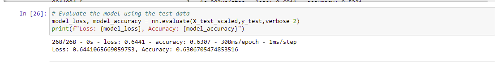
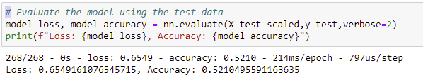
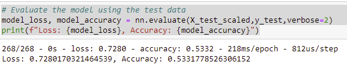
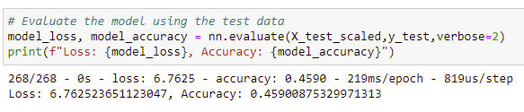

# Neural_Network_Charity_Analysis

## Overview

The purpose of this project was to employ Machine Learning and Neural Networks.  The task assigned was to utilize these tools in an effort to better predict if an applicant would be successful.  As part of this process we needed to complete the following steps:
- Preprocess the data
- Compile, Train, and Evaluate the Model
- Optimize the Model

## Results

### Prepocessing the Data
- The target variable in this data was the column labeled IS_SUCCESSFUL
- I dropped the columsn labeled EIN, NAME as these did not appear to be impacful to the overall outcome of the research.
- The feature variables were all remaining columns excluding the ones listed above as they were the target or dropped.

### Compile, Train, and Evaluate the Model

Initially I elected to utilize 80 neurons in the first hidden layer and 30 in the second hidden layer.  The output layer was activated using the Sigmoid function while the other layers were activated using Relu.

In review of this initial review it was found that the model was not able to reach the target accuracy of 75% and we only reached 63%

### Increase Model Performance

As we did not originally reach the model performance I began to test other ways to improve this performance.

- Initial attempt was to also remove the columsn labeled SPECIAL_CONSIDERATIONS and USE_CASE.

As you can see above the results showed a drop in accuracy with an overall accuracy of 52%

- Second attempt we upped the neurons and added another layer to the model.

In this attempt we did see a slight improvement in the model compared to the first attempt as the overall accuracy increased to 53%

- Final attempt we continued with all of the changes above and implemented TANH instead of Sigmoid as our activator for the output.

This was the lowest result in accuracy as it dropped to 46%

## Summary
After optimization the model ended up with a very low accuracy of 46% vs the initial accuracy score of 63%.  The model had overfitted and clearly saw that some of the columns removed were more impactful than initially believed. 
